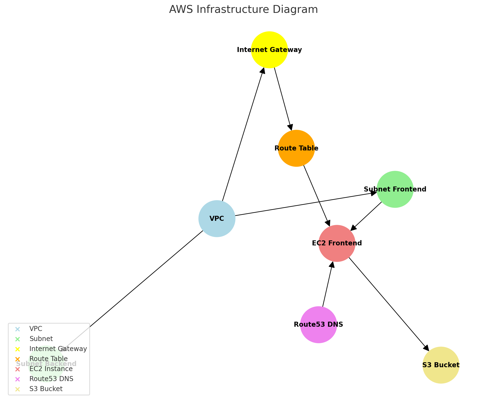

# **Infra Terraform AWS**

<p align="center">
  
</p>

[](./LICENSE)
[](#)


A Terraform-based infrastructure project deploying AWS VPC, EC2 instances, Route53 DNS records, and setting up Nginx & Docker for serving frontends. This project focuses on scalability, modularity, and providing a reproducible environment setup.

<p align="center">
      
</p>

## **Table of Contents**

- [Introduction](#introduction)
- [Features](#features)
- [Requirements](#requirements)
- [Installation](#installation)
- [Usage](#usage)
- [Project Structure](#project-structure)
- [Key Dependencies](#key-dependencies)
- [Testing](#testing)
- [License](#license)
- [Contributing](#contributing)
- [Contact](#contact)

## **Introduction**

**Infra Terraform AWS** is designed to provision a ready-to-use AWS infrastructure:
- A VPC with subnets, routing, and security groups.
- An EC2 instance serving a frontend application via Nginx and Docker.
- Route53 DNS records pointing your domain to the EC2 instance.

This infrastructure allows you to quickly spin up a controlled environment for your web services.

## **Features**

- ✅ Automated infrastructure deployment with Terraform  
- ✅ Configurable AWS credentials and parameters via `terraform.tfvars`  
- ✅ Easy start/stop with provided shell scripts (deploy/destroy/reset)  
- ✅ Nginx + Docker setup for serving frontend static files  
- ✅ Route53 DNS integration

## **Requirements**

- **Terraform**: `>= 1.0.0`  
- **AWS CLI** (optional for testing and debugging)  
- **Node.js** and **Yarn** are required if you plan to build or manage frontend assets (not strictly required for pure infrastructure deployment).

## **Installation**

### Steps

1. Clone the repository:
   ```bash
   git clone https://github.com/5h1ngy/infra-terraform-aws.git
   cd infra-terraform-aws
   ```

2. Copy and rename the example files for sensitive data:
   ```bash
   cp examples/terraform.tfvars.example terraform/terraform.tfvars
   cp examples/ssh-keys/id_rsa_terraform.example data/ssh/id_rsa_terraform
   cp examples/ssh-keys/id_rsa_terraform.pub.example data/ssh/id_rsa_terraform.pub
   ```
   Edit `terraform/terraform.tfvars` to insert your AWS credentials and config.
   
   *Do not commit these files with real credentials.*

3. (Optional) If using AWS CLI:
   ```bash
   cp examples/aws-credentials.example .env
   ```
   Update `.env` with your AWS keys and load them into your environment before using AWS CLI.

4. Initialize Terraform and apply:
   ```bash
   cd terraform
   terraform init
   terraform validate
   terraform plan
   terraform apply -auto-approve
   ```

## **Usage**

- **deploy.sh**: Deploys the infrastructure, runs `terraform apply`.
- **destroy.sh**: Destroys all Terraform-managed resources.
- **reset.sh**: Removes local Terraform state and output files, allowing a clean re-apply.
- **nuke.sh**: **Dangerous!** Removes almost all major AWS resources in the account. Use with caution.

You can find these scripts in the `scripts/` directory.

## **Project Structure**

```plaintext
infra-terraform-aws/
├── .gitignore
├── README.md
├── examples/
│   ├── terraform.tfvars.example
│   ├── aws-credentials.example
│   └── ssh-keys/
│       ├── id_rsa_terraform.example
│       └── id_rsa_terraform.pub.example
├── scripts/
│   ├── deploy.sh
│   ├── destroy.sh
│   ├── reset.sh
│   └── nuke.sh
└── terraform/
    ├── provider.tf
    ├── variables.tf
    ├── terraform.tfvars         # not committed, created from .example
    ├── networking.tf
    ├── compute.tf
    ├── security.tf
    ├── dns.tf
    ├── output.tf
    └── data/
        ├── ssl/                # SSL certificates (not committed)
        ├── templates/          # Nginx, Docker-compose templates
        ├── services/           # Service artifacts (e.g., frontend.zip)
        └── ssh/                # SSH keys (not committed)
```

## **Key Dependencies**

- **Terraform**: Infrastructure as Code tool
- **AWS Provider for Terraform**: Manages AWS resources
- **Nginx**, **Docker**, **Docker Compose**: Provisioned on the EC2 instance to serve the frontend

For detailed dependencies and versions, see individual `.tf` files and scripts.

## **Testing**

Infrastructure testing can be done using:
- **terraform plan**: to ensure no unexpected changes.
- **aws cli**: to verify resources, e.g. `aws ec2 describe-instances`.

There is no direct unit-testing framework integrated for infrastructure. For frontend testing, integrate with your CI/CD pipeline after deployment.

## **License**

This project is licensed under the [MIT License](./LICENSE).

## **Contact**

- **Repository**: [https://github.com/5h1ngy/infra-terraform-aws.git](https://github.com/5h1ngy/infra-terraform-aws.git)  
- **Author**: [5h1ngy](https://github.com/5h1ngy) 
